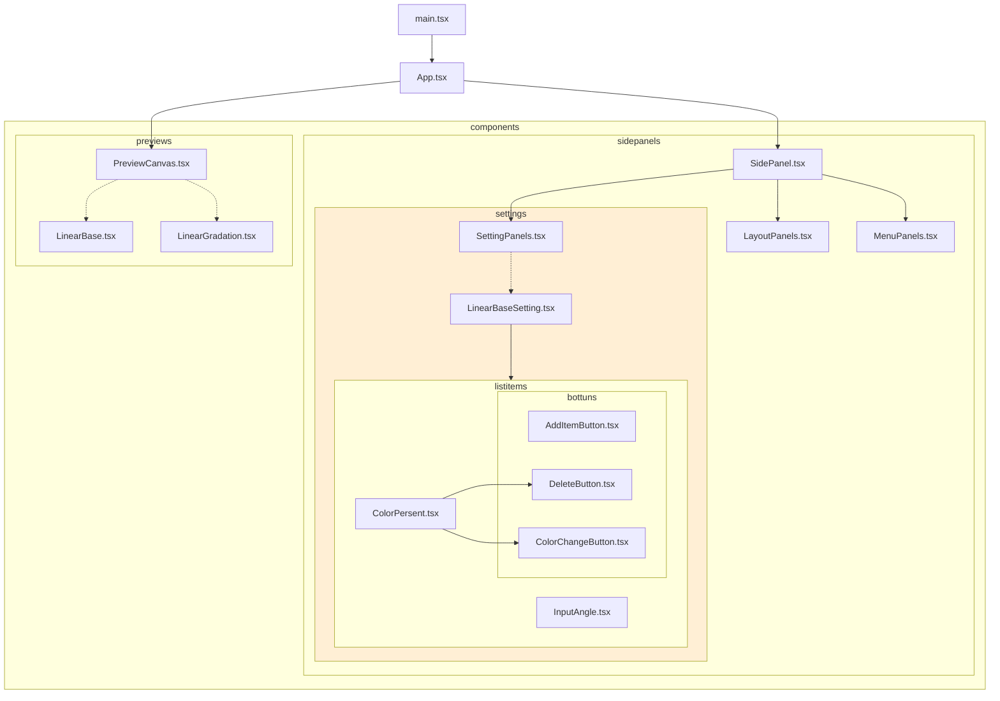

## 要件
* レイアウトごとに色を設定できるようにする
* レイアウトごとに設定できるパラメータは異なる
* 色の数は増加または減少させることが出来る

## 技術スタック

## 構成図

```mermaid
graph TD
  app[App.tsx]
  main[main.tsx]

  main --> app
  app --> sidepanel & previewcanvas

  subgraph components[components]
    previews
    sidepanels
  end

  subgraph sidepanels[sidepanels]
    sidepanel[SidePanel.tsx]
    layoutpanel[LayoutPanels.tsx]
    menupanel[MenuPanels.tsx]

    subgraph settings[settings]
      settingpanel[SettingPanels.tsx]
      linearbasesetting[LinearBaseSetting.tsx]
      
      subgraph listitems
      subgraph buttons[bottuns]
          additembutton[AddItemButton.tsx]
          colorchangebutton[ColorChangeButton.tsx]
          deletebutton[DeleteButton.tsx]
        end
        
        colorpersent[ColorPersent.tsx]
        inputangle[InputAngle.tsx]
      end

    end

    sidepanel --> settingpanel & layoutpanel & menupanel
    settingpanel -.-> linearbasesetting ---> listitems
    colorpersent --> deletebutton & colorchangebutton

  end

  subgraph previews[previews]
    previewcanvas[PreviewCanvas.tsx]
    linearbase[LinearBase.tsx]
    lineargradation[LinearGradation.tsx]

    previewcanvas -.-> linearbase & lineargradation
  end

  %% 作業状況をわかり役するための色の定義
  classDef active fill:#ffefd5

  %% 作業箇所
  class settings active


```

